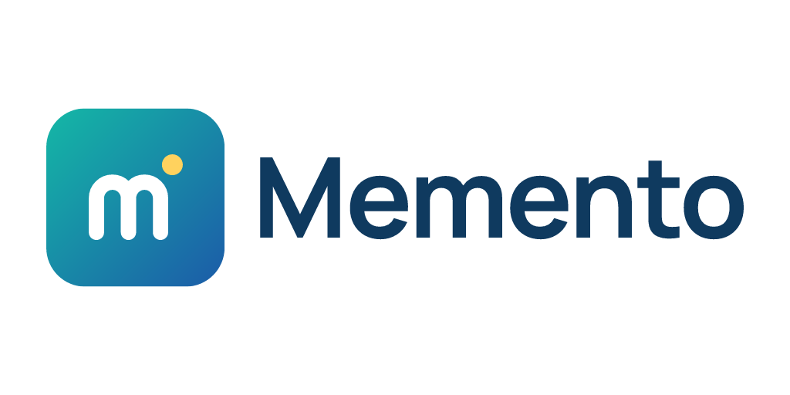
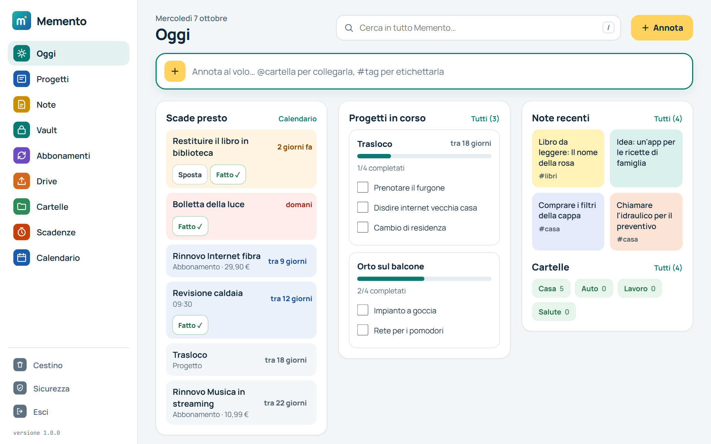
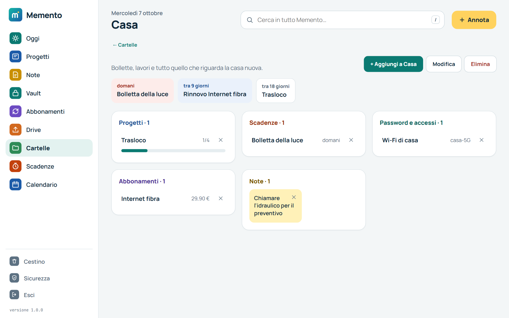
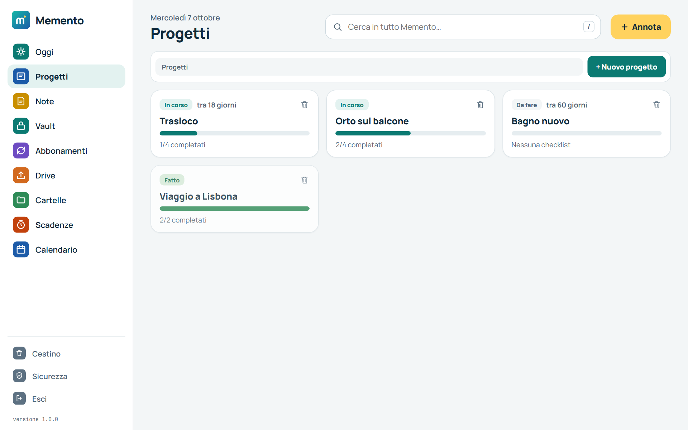
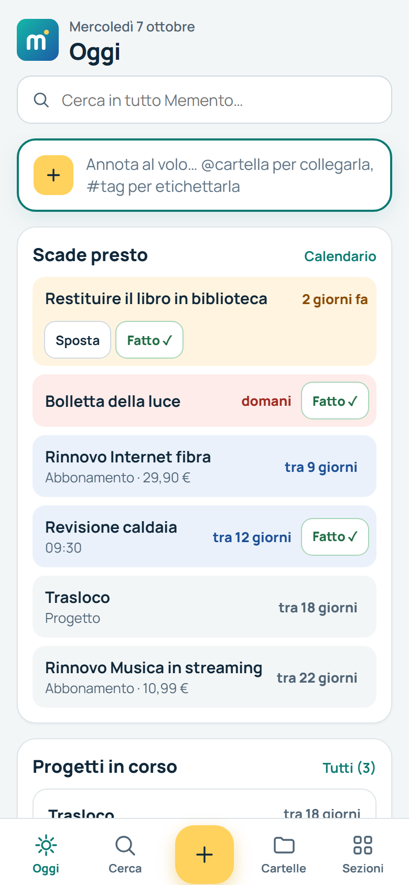
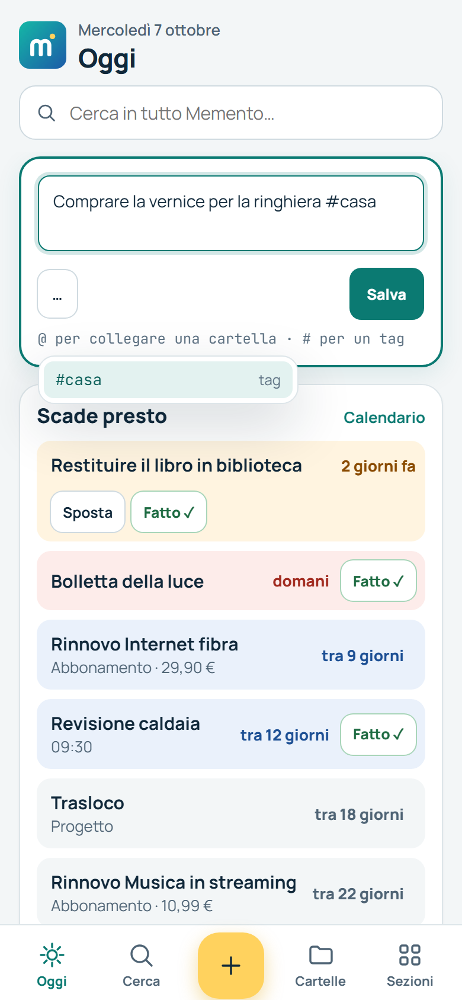
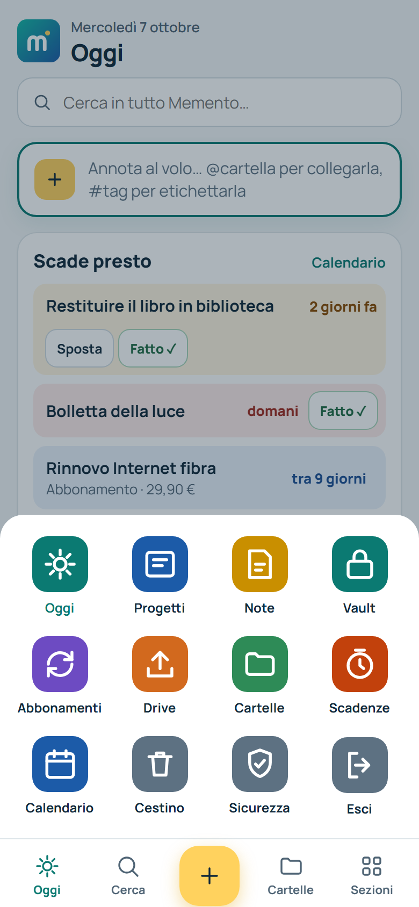

<p align="center"></p>

Spazio personale self-hosted per idee, progetti, password, abbonamenti e documenti, con **cartelle** che li collegano tra loro. Gira interamente sul tuo computer o server, dentro Docker: nessun dato lascia la tua macchina.

Gratuito e open source (licenza MIT). Pagina del progetto: **[phloppy.it/memento](https://www.phloppy.it/memento)**.

## Come si presenta

**Oggi** — cosa scade, i progetti in corso con le spunte toccabili sul posto, le note recenti e le cartelle:



**Una cartella** — tutto quello che riguarda un tema, diviso per tipo, con le sue scadenze in cima:



**Progetti** — stato, scadenza e avanzamento visibili senza aprirli:



**Sul telefono** — la schermata Oggi, "Annota al volo" che si apre dove lo tocchi (con i suggerimenti per `#tag` e `@cartella`), tutte le sezioni a un tocco:

<p>
  
  
  
</p>

<sub>Dati di esempio.</sub>

## Cosa contiene

- **Oggi** — la schermata d'ingresso: tutto quello che scade (promemoria, progetti, rinnovi, documenti) scritto come "domani", "tra 12 giorni", i progetti in corso con le spunte toccabili sul posto, le note recenti e le cartelle
- **Note** — libere, con tag, `#hashtag` e checklist spuntabile
- **Cattura veloce** — "Annota" è sempre a un tocco (in alto su computer, il "+" giallo su telefono); `@` collega a una cartella, `#` aggiunge un tag, il pulsante "…" trasforma la nota in promemoria/progetto al momento del salvataggio
- **Progetti** — stato (da fare / in corso / fatto), checklist, scadenza, persone/contatti e budget; ogni progetto è una scheda con avanzamento e scadenza visibili senza aprirla
- **Vault password** — voci cifrate (AES-256-GCM), con **import da CSV**
- **Abbonamenti** — account digitali o abbonamenti cartacei/fisici, con campi propri per ciascuno e data di rinnovo
- **Drive** — upload documenti, organizzati in cartelle, con nome personalizzato, anteprima (immagini e PDF) e scadenza opzionale
- **Cartelle** — collegano insieme note, progetti, voci del vault, abbonamenti, documenti e scadenze sullo stesso tema; aprendo una cartella vedi tutto il suo contenuto diviso per tipo, con le sue scadenze in cima
- **Scadenze e Calendario** — elenco piatto o vista mensile, con notifiche push opzionali (anche ad app chiusa) quando una scadenza arriva a termine
- **Ricerca globale** — cerca in tutte le sezioni insieme
- **Cestino** — eliminazione soft con possibilità di ripristino
- **Backup** — esporta un file .zip con database e documenti caricati
- **Italiano e inglese** — si sceglie al primo avvio, si cambia da Sicurezza

## Requisiti

Solo **Docker Desktop** (Windows/macOS) o **Docker Engine + Docker Compose** (Linux). Nient'altro — Node.js, database o altre dipendenze vengono gestiti automaticamente dentro il container.

- Scarica Docker Desktop: https://docs.docker.com/get-docker/
- Assicurati che sia **avviato** prima di procedere (l'icona della balena nella barra delle applicazioni/menu bar).

## Avvio rapido

1. Scarica questo repository (`Code → Download ZIP` su GitHub, oppure `git clone`) ed estrailo.
2. Apri un terminale nella cartella del progetto ed esegui lo script adatto al tuo sistema:

   **Linux / macOS**
   ```bash
   ./setup.sh
   ```

   **Windows (PowerShell)**
   ```powershell
   .\setup.ps1
   ```

Lo script controlla che Docker sia installato e avviato, crea automaticamente il file `.env` con dei segreti generati in modo casuale (non devi scrivere nulla a mano), **verifica se la porta 3000 è libera e, se è occupata, ne sceglie automaticamente un'altra libera**, avvia il container e ti avvisa quando l'app è pronta — mostrandoti l'indirizzo esatto da aprire.

3. Apri il browser all'indirizzo che lo script ti indica (di norma **http://localhost:3000**, oppure un'altra porta se la 3000 era occupata). Al primo accesso ti verrà chiesto di creare il tuo username e la password.

> Se lo script segnala un permesso negato su Linux/macOS, rendilo eseguibile con `chmod +x setup.sh` e rilancialo.

### Avvio manuale (alternativa allo script)

`.env` è **facoltativo**: se non lo crei, Memento genera da solo `SESSION_SECRET` ed `ENCRYPTION_KEY` al primo avvio e li salva in `data/.secrets.env` (sopravvivono a riavvii e rebuild, esattamente come il database). Quindi basta:

```bash
docker compose up -d --build
```

Serve un `.env` solo se vuoi personalizzare qualcosa (porta, durata sessione, o portarti dietro tue chiavi):

```bash
cp env.example .env
# modifica i valori che ti interessano
docker compose up -d --build
```

## Installazione su CasaOS

**Senza terminale** (più rapida): dal pannello CasaOS apri **App Store** → icona **"Installa un'app personalizzata"** → scheda **Docker Compose** → incolla il contenuto di [`casaos-compose.yml`](casaos-compose.yml) → **Installa**. CasaOS scarica l'immagine già pronta (nessuna compilazione sul NAS) e crea da solo le cartelle dati sotto `/DATA/AppData/`. Al primo accesso ti verrà chiesto di creare username e password, esattamente come nell'avvio rapido.

> CasaOS non legge nome e icona dai file installati in questo modo (li assegna solo alle app del suo catalogo ufficiale): l'app comparirà con un nome generato a caso e un'icona generica. Puoi correggerli a mano dalla card dell'app appena installata, nelle sue impostazioni.

**Da terminale** (SSH o l'app "Terminale" di CasaOS): CasaOS è basato su Debian con Docker già installato, quindi vale la stessa procedura descritta in "Avvio rapido":

```bash
git clone https://github.com/katergaris/MindKeep.git memento
cd memento
./setup.sh
```

> Se manca `git`, installalo prima con `sudo apt-get update && sudo apt-get install -y git`.

## Dati e persistenza

- `./data/memento.db` — database SQLite (idee, progetti, metadati vault/account/documenti/fascicoli)
- `./data/.secrets.env` — **solo se non hai creato un `.env` tu stesso**: `SESSION_SECRET` ed `ENCRYPTION_KEY` generati automaticamente al primo avvio
- `./uploads/` — file caricati nel Drive

Entrambe le cartelle sono montate come volumi Docker: i dati sopravvivono a riavvii e rebuild del container. Fanne comunque un backup periodico (vedi sotto) e **non cancellare mai `./data`** (ne' `.env`, se lo hai creato tu) — è lì che si trova la chiave con cui sono cifrate le password nel vault.

**Salvare gli allegati altrove (es. un HDD esterno):** di default `./uploads` sta nella stessa cartella del progetto. Per usare un disco diverso, imposta `UPLOADS_DIR=/percorso/del/tuo/disco` nel `.env` e riavvia (`docker compose up -d`) — non serve toccare `docker-compose.yml`. Su CasaOS (installazione da "App personalizzata"), lo stesso si fa dal selettore di percorso che CasaOS mostra per ogni volume durante l'installazione: puoi puntarlo direttamente a un disco esterno collegato al NAS.

## Durata dell'accesso

Di default **l'accesso non scade mai**: una volta entrato resti dentro finché non premi "Esci", anche dopo un riavvio del container.

Se preferisci che l'accesso scada, imposta `SESSION_DAYS` nel file `.env` con il numero di giorni desiderato e riavvia (`docker compose up -d`):

```bash
SESSION_DAYS=0    # non scade mai (predefinito)
SESSION_DAYS=7    # scade dopo 7 giorni in cui non apri mai Memento
```

Il conteggio riparte a ogni utilizzo: con `SESSION_DAYS=7`, se apri Memento almeno una volta a settimana non ti verrà mai richiesta la password. All'avvio il container scrive nei log quale impostazione è attiva.

> Con `SESSION_DAYS=0` chiunque usi quel browser entra senza password. Se il computer è condiviso, imposta un numero di giorni oppure ricordati di premere "Esci".

## Dal telefono

L'interfaccia è pensata prima di tutto per il telefono: al posto della barra laterale compare una **barra in basso** con Oggi, Cerca, il "+" per annotare, Cartelle e "Sezioni" (tutte le altre, più "Esci"). Il tasto "indietro" del telefono torna alla sezione precedente.

Puoi anche **aggiungerlo alla schermata home** e usarlo come un'app, senza barra del browser: dal telefono apri l'indirizzo di Memento e scegli "Aggiungi a schermata Home" (Safari) o "Installa app" / "Aggiungi a schermata Home" (Chrome). Serve che il telefono raggiunga il server: stessa rete di casa, oppure una VPN.

## Verifica in due passaggi (Google Authenticator)

Facoltativa, si attiva da **Sicurezza**. Una volta attiva, per entrare servono la password *e* un codice a 6 cifre generato dal telefono.

1. Premi "Attiva con QR": Memento mostra un codice QR.
2. Apri **Google Authenticator** (vanno bene anche Aegis, 1Password, Authy, Bitwarden: è lo standard TOTP, non un meccanismo proprietario di Google) e inquadralo. Se la fotocamera non collabora, nell'app scegli "Inserisci chiave di configurazione" e digita il segreto scritto sotto al QR.
3. Scrivi il codice a 6 cifre che compare nell'app per confermare, e **salva gli 8 codici di recupero** che ti vengono mostrati: sono l'unica via di rientro se perdi il telefono, si vedono una volta sola e ognuno funziona una volta sola.

Il QR viene disegnato dal tuo server e i codici sono calcolati dall'ora corrente: **non serve connessione a internet** e nessun dato viene inviato a Google o a chiunque altro.

**Se perdi il telefono:** scrivi uno dei codici di recupero al posto delle 6 cifre nella schermata di accesso. Se hai perso anche quelli, dal computer dove gira Memento:

```bash
docker compose exec memento node server/disable-2fa.js
```

> La verifica in due passaggi protegge l'*accesso all'app*, non i dati sul disco: chi ha in mano il file `.env` e il database può comunque decifrare il vault. Serve contro chi indovina o ruba la password, non contro chi ha accesso fisico al server.

## Impronta digitale / Face ID per il vault

Facoltativa, si attiva da **Sicurezza** con "Aggiungi impronta su questo dispositivo". Una volta registrata almeno un'impronta per l'account, **rivelare una password del vault** (l'icona a occhio) chiede il tocco (impronta, Face ID o Windows Hello) invece di bastare la sola sessione aperta — utile soprattutto da telefono, dove la sessione resta spesso aperta a lungo.

- È per dispositivo: registrala separatamente su ogni telefono/computer da cui vuoi il tocco per rivelare le password. Se non la registri su un dispositivo, lì il reveal continua a funzionare come prima (nessuna impronta = nessun blocco).
- Usa WebAuthn (lo standard delle passkey): la chiave privata resta nel dispositivo, sul server viene salvata solo quella pubblica.
- Richiede **HTTPS** (va bene anche `localhost` in sviluppo): i browser non espongono l'impronta su un semplice `http://`, incluso l'accesso via IP della rete locale senza certificato.
- Per rimuoverla da **Sicurezza** serve la password dell'account, come per disattivare la verifica in due passaggi.

## Backup

Da **Sicurezza**, "Esporta backup" scarica uno `.zip` con il database e tutti i documenti del Drive. Conservalo, insieme a una copia del file `.env`, in un posto sicuro e separato dal server.

## Import CSV nel vault

Nella sezione Vault, "Importa CSV" accetta file con intestazioni comuni (esportazioni da browser o altri password manager):

| Campo riconosciuto | Intestazioni accettate |
|---|---|
| Sito | `site`, `name`, `title` |
| Username | `username`, `login`, `email`, `user` |
| Password | `password`, `pass` |
| URL | `url`, `link`, `website` |
| Note | `notes`, `note`, `comment` |

Sono obbligatorie almeno le colonne per sito e password. Le righe incomplete vengono saltate e segnalate a fine import.

## Risoluzione dei problemi

**Lo script dice che Docker non è avviato**
Apri Docker Desktop e attendi che l'icona nella barra indichi "Running", poi rilancia lo script.

**La porta 3000 è già occupata**
Se usi `setup.sh` o `setup.ps1`, non devi fare nulla: lo script se ne accorge da solo e sceglie automaticamente la prima porta libera successiva, aggiornando `HOST_PORT` in `.env`. Se invece avvii tutto a mano, modifica `HOST_PORT` in `.env` (es. `HOST_PORT=3001`) e rilancia `docker compose up -d --build` — non serve toccare `docker-compose.yml`.

**`docker compose` non è riconosciuto**
Su installazioni più datate il comando è `docker-compose` (con il trattino). Gli script di setup lo rilevano automaticamente; se lanci i comandi a mano, usa quello disponibile sul tuo sistema.

**Ho perso il file `.env` / la ENCRYPTION_KEY**
Le password salvate nel vault non sono più recuperabili senza la chiave originale: è una conseguenza della cifratura, non un bug. Per questo lo script ti avvisa di conservarne una copia. Il resto dei dati (idee, progetti, account, documenti, fascicoli) non viene toccato.

**Voglio vedere cosa succede durante l'avvio**
```bash
docker compose logs -f
```

**Voglio ripartire da zero**
```bash
docker compose down
rm -rf data uploads   # attenzione: cancella tutti i dati salvati
./setup.sh
```

## Sicurezza — cosa sapere

- Le password del vault sono cifrate con AES-256-GCM; la chiave deriva dalla `ENCRYPTION_KEY` che imposti tu (o che lo script genera per te) e non viene mai salvata nel database.
- L'accesso all'app è protetto da un singolo utente (username + password, hash bcrypt) con sessione via cookie, e facoltativamente da una verifica in due passaggi con app di autenticazione (TOTP).
- La rivelazione di una password del vault può essere protetta per-dispositivo con impronta/Face ID (WebAuthn); senza dispositivi registrati funziona come prima, con la sola sessione autenticata.
- Dopo 10 tentativi di accesso falliti dallo stesso indirizzo, il login si blocca per 15 minuti.
- Questo è uno strumento pensato per uso personale su una rete che controlli (rete domestica, VPN, NAS). Non ha avuto un audit di sicurezza professionale: per password particolarmente critiche, valuta di affiancare uno strumento dedicato e verificato come Vaultwarden, usando Memento per il resto.
- Se esponi Memento su internet, mettilo dietro HTTPS (es. reverse proxy con Caddy/Traefik/Nginx) e considera un livello aggiuntivo di autenticazione (es. VPN).

## Struttura del progetto

```
memento/
├── setup.sh / setup.ps1   # installazione guidata (Linux-macOS / Windows)
├── docker-compose.yml
├── Dockerfile
├── env.example
├── LICENSE
├── package.json
├── server/
│   ├── index.js            # server Express, autenticazione, sessioni, health check
│   ├── db.js                # connessione SQLite e schema
│   ├── crypto.js             # cifratura AES-256-GCM del vault
│   ├── auth.js                 # setup utente, login, middleware
│   ├── totp.js                  # verifica in due passaggi (TOTP, RFC 6238)
│   ├── disable-2fa.js            # disattiva il 2FA da riga di comando (telefono perso)
│   ├── session-store.js           # sessioni salvate su SQLite (sopravvivono ai riavvii)
│   └── routes/                  # API REST per ogni sezione
└── public/                       # frontend (HTML/CSS/JS, nessuna build richiesta)
    ├── manifest.webmanifest   # aggiunta alla schermata home del telefono
    └── icon-*.png              # icone dell'app
```

## Licenza

Distribuito con licenza MIT — vedi [LICENSE](LICENSE). Puoi usarlo, modificarlo e ridistribuirlo liberamente.
